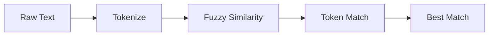

The **NLP & Fuzzy Matching** system enables intelligent matching of exam topics across different naming conventions used by various exam boards (bancas). It handles typos, synonyms, word order variations, and semantic equivalence.

## System Architecture

The matching pipeline consists of four core components:



1. **Tokenization** - Normalize and split text into semantic units
2. **Levenshtein Distance** - Calculate edit distance between words
3. **Fuzzy Similarity** - Convert distance to 0-1 similarity score
4. **Token Matching** - Compare token sets with confidence scoring

## Tokenization Pipeline

The `tokenize` function transforms raw text into a normalized array of meaningful tokens.

### Algorithm

```javascript
export function tokenize(text) {
    if (!text) return [];
    
    const normalized = text.toLowerCase()
        .normalize('NFD').replace(/[\u0300-\u036f]/g, '') // Remove accents
        .replace(/[^\w\s]/gi, ' ')  // Remove non-alphanumeric
        .replace(/\s+/g, ' ')        // Collapse whitespace
        .trim();

    return normalized.split(' ')
        .filter(word => word.length > 2 && !STOPWORDS.has(word));
}
```

### Normalization Stages

#### 1. Case Normalization
```javascript
"Direito CONSTITUCIONAL" → "direito constitucional"
```

#### 2. Accent Removal (NFD Decomposition)
```javascript
"Princípios Fundamentais" → "principios fundamentais"
```

<Accordion title="Why NFD normalization?">
NFD (Canonical Decomposition) separates base characters from combining diacritical marks:

- `"á"` becomes `"a" + "◌́"` (base + combining acute accent)
- The regex `[\u0300-\u036f]` removes all combining marks
- This handles all Portuguese accents: á, é, í, ó, ú, ã, õ, ç, etc.

This is more reliable than manual replacement tables and works with any Unicode text.
</Accordion>

#### 3. Punctuation Removal
```javascript
"Art. 5º, Inciso I" → "art 5 inciso i"
```

#### 4. Whitespace Collapse
```javascript
"direito    constitucional" → "direito constitucional"
```

### Stopword Filtering

Common words that don't add semantic value are removed:

```javascript
const STOPWORDS = new Set([
    // Articles
    'o', 'a', 'os', 'as', 'um', 'uma', 'uns', 'umas',
    
    // Prepositions
    'de', 'do', 'da', 'dos', 'das',
    'em', 'no', 'na', 'nos', 'nas',
    'por', 'pelo', 'pela', 'pelos', 'pelas',
    'para', 'pro', 'pra', 'com', 'sem',
    
    // Conjunctions
    'e', 'ou', 'mas', 'porém', 'todavia', 'contudo',
    
    // Generic legal terms
    'lei', 'artigo', 'art', 'inciso', 'capítulo', 'título',
    'conceito', 'noções', 'introdução', 'teoria', 'geral', 'parte'
]);
```

<Note>
Legal generic terms like "artigo" and "lei" are stopwords because they appear in almost every topic name but don't help distinguish between topics.
</Note>

### Word Length Filter

Words must be >2 characters to be meaningful:

```javascript
.filter(word => word.length > 2 && !STOPWORDS.has(word))
```

### Example Transformation

```javascript
Input:  "Lei 8.112/90 - Regime Jurídico dos Servidores Públicos"
Output: ["regime", "juridico", "servidores", "publicos"]
```

## Levenshtein Distance

The **Levenshtein distance** measures the minimum number of single-character edits (insertions, deletions, substitutions) needed to transform one word into another.

### Implementation

```javascript
export function levenshteinDistance(a, b) {
    if (a.length === 0) return b.length;
    if (b.length === 0) return a.length;

    // Create matrix [a.length+1 x b.length+1]
    const matrix = Array(a.length + 1)
        .fill(null)
        .map(() => Array(b.length + 1).fill(null));

    // Initialize first column (deletions from a)
    for (let i = 0; i <= a.length; i++) matrix[i][0] = i;
    
    // Initialize first row (insertions to a)
    for (let j = 0; j <= b.length; j++) matrix[0][j] = j;

    // Fill matrix using dynamic programming
    for (let i = 1; i <= a.length; i++) {
        for (let j = 1; j <= b.length; j++) {
            const cost = a[i - 1] === b[j - 1] ? 0 : 1;
            matrix[i][j] = Math.min(
                matrix[i - 1][j] + 1,       // deletion
                matrix[i][j - 1] + 1,       // insertion
                matrix[i - 1][j - 1] + cost // substitution
            );
        }
    }
    
    return matrix[a.length][b.length];
}
```

### Algorithm Walkthrough

Comparing `"casa"` and `"cama"`:

```
      "" c  a  m  a
  "" [ 0  1  2  3  4 ]
  c  [ 1  0  1  2  3 ]
  a  [ 2  1  0  1  2 ]
  s  [ 3  2  1  1  2 ]
  a  [ 4  3  2  2  1 ]
```

- Bottom-right cell: **1** edit needed (substitute `s` → `m`)
- Path: `casa` → `cama` (1 substitution)

<Accordion title="Why dynamic programming?">
Brute force would require checking all possible edit sequences - exponential complexity O(3^n).

Dynamic programming builds the solution bottom-up:
- Each cell represents the minimum edits for substrings
- Time complexity: **O(m × n)**
- Space complexity: **O(m × n)**

For typical word pairs (5-15 chars), this is extremely fast (less than 1ms).
</Accordion>

### Example Distances

```javascript
levenshteinDistance("constitucional", "constitucional") // 0 - exact match
levenshteinDistance("constitucional", "constitucional") // 1 - typo
levenshteinDistance("penal", "penal")                   // 0 - exact
levenshteinDistance("penal", "civil")                   // 5 - different words
```

## Fuzzy Similarity Score

The `fuzzySimiliarity` function converts edit distance to a normalized 0-1 similarity score.

### Algorithm

```javascript
export function fuzzySimiliarity(word1, word2) {
    const dist = levenshteinDistance(word1, word2);
    const maxLen = Math.max(word1.length, word2.length);
    if (maxLen === 0) return 1.0;
    return (maxLen - dist) / maxLen;
}
```

### Formula

```
similarity = (max_length - edit_distance) / max_length
```

- **1.0** = identical strings
- **0.0** = completely different (distance ≥ length)

### Examples

```javascript
fuzzySimiliarity("constitucional", "constitucional") // 1.00 - exact
fuzzySimiliarity("constitucional", "constituicional") // 0.93 - typo
fuzzySimiliarity("direito", "dirieto")               // 0.71 - transposition
fuzzySimiliarity("penal", "civil")                   // 0.00 - unrelated
```

<Note>
**Threshold:** The system considers words "matching" if similarity > 0.8 (80%). This balances tolerance for typos while rejecting false positives.
</Note>

## Token Set Matching

The `computeTokenMatch` function compares two token arrays and returns an overall match percentage.

### Algorithm

```javascript
export function computeTokenMatch(tokensA, tokensB) {
    if (tokensA.length === 0 || tokensB.length === 0) return 0;

    let matches = 0;
    
    // For each token in A, find best fuzzy match in B
    for (const ta of tokensA) {
        let bestWordScore = 0;
        for (const tb of tokensB) {
            const sc = fuzzySimiliarity(ta, tb);
            if (sc > bestWordScore) bestWordScore = sc;
        }
        // Count as match if best similarity > 80%
        if (bestWordScore > 0.8) {
            matches++;
        }
    }
    
    // Normalize by maximum token count (Jaccard-inspired)
    return matches / Math.max(tokensA.length, tokensB.length);
}
```

### Match Strategy

1. **Best-Match Pairing:** Each token in A seeks its closest match in B
2. **Threshold Filtering:** Only similarities >0.8 count as matches
3. **Jaccard Normalization:** Divide by max length (penalizes size mismatch)

<Accordion title="Why maximum length instead of average?">
Using `max(lengthA, lengthB)` instead of average prevents inflated scores when comparing short topics to long ones:

```javascript
tokensA = ["direito", "penal"]           // 2 tokens
tokensB = ["direito", "penal", "parte", "geral"]  // 4 tokens
matches = 2

With average: 2 / ((2+4)/2) = 0.66  ❌ Too high!
With maximum: 2 / 4 = 0.50          ✅ More accurate
```

This prevents partial topics from scoring artificially high against comprehensive ones.
</Accordion>

### Example Comparison

```javascript
const tokensA = tokenize("Direito Constitucional - Princípios Fundamentais");
const tokensB = tokenize("Princípios Fundamentais do Direito Constitucional");

console.log(tokensA); // ["direito", "constitucional", "principios", "fundamentais"]
console.log(tokensB); // ["principios", "fundamentais", "direito", "constitucional"]

computeTokenMatch(tokensA, tokensB); // 1.0 - all 4 tokens match
```

## Best Match Search

The `findBestMatch` function searches the entire banca database to find the most relevant topic.

### Algorithm

```javascript
export function findBestMatch(editalSubjectName, disciplinaId = null) {
    const hotTopics = state.bancaRelevance?.hotTopics || [];
    const userMap = state.bancaRelevance?.userMappings?.[editalSubjectName];

    // 1. Check manual override
    if (userMap) {
        if (userMap === 'NONE') {
            return { matchedItem: null, score: 0.05, confidence: 'HIGH', 
                     reason: 'Marcado como sem incidência pelo usuário' };
        }
        const forcedMatch = hotTopics.find(h => h.id === userMap);
        if (forcedMatch) {
            return { matchedItem: forcedMatch, score: 1.0, confidence: 'HIGH', 
                     reason: 'Mapeamento Fixado Manualmente' };
        }
    }

    // 2. Search hot topics database
    if (!hotTopics.length) {
        return { matchedItem: null, score: 0.05, confidence: 'LOW', 
                 reason: 'Nenhum dado de banca definido' };
    }

    const tokensA = tokenize(editalSubjectName);
    const strA = editalSubjectName.toLowerCase().trim();

    let bestMatch = null;
    let highestScore = 0;
    let bestReason = '';
    let bestConf = 'LOW';

    for (const ht of hotTopics) {
        // Filter by discipline if specified
        if (disciplinaId && ht.disciplinaId && ht.disciplinaId !== disciplinaId) continue;

        const strB = ht.nome.toLowerCase().trim();

        // A. Exact match
        if (strA === strB) {
            return { matchedItem: ht, score: 1.0, confidence: 'HIGH', 
                     reason: 'Match Exato de Título' };
        }

        // B. Inclusion match (one contains the other)
        if (strA.includes(strB) || strB.includes(strA)) {
            const sc = 0.9;
            if (sc > highestScore) {
                highestScore = sc;
                bestMatch = ht;
                bestReason = 'Contém Nome Parcial';
                bestConf = 'HIGH';
            }
        }

        // C. Token-based fuzzy match
        const tokensB = tokenize(ht.nome);
        const tokenScore = computeTokenMatch(tokensA, tokensB);

        if (tokenScore > highestScore) {
            highestScore = tokenScore;
            bestMatch = ht;
            if (tokenScore > 0.8) {
                bestConf = 'MEDIUM';
                bestReason = 'Termos Altamente Similares (Algoritmo)';
            } else {
                bestConf = 'LOW';
                bestReason = `Plausível Semelhança Textual (${Math.round(tokenScore * 100)}%)`;
            }
        }
    }

    // Reject weak matches
    if (highestScore < 0.4) {
        return { matchedItem: null, score: 0.05, confidence: 'HIGH', 
                 reason: 'Sem incidência detectada nas chaves da Banca' };
    }

    return { matchedItem: bestMatch, score: highestScore, 
             confidence: bestConf, reason: bestReason };
}
```

### Match Hierarchy

1. **Manual Override** (score: 1.0, HIGH)
   - User explicitly mapped topic
   
2. **Exact Match** (score: 1.0, HIGH)
   - Identical strings after normalization
   
3. **Inclusion Match** (score: 0.9, HIGH)
   - One string contains the other
   - Example: "Direito Penal" ⊂ "Direito Penal - Parte Geral"
   
4. **Fuzzy Token Match** (score: variable, MEDIUM/LOW)
   - Token similarity > 0.8 → MEDIUM confidence
   - Token similarity 0.4-0.8 → LOW confidence
   
5. **No Match** (score: 0.05, HIGH)
   - All matches below 0.4 threshold

<Warning>
The system returns `confidence: 'HIGH'` for "no match" because it's highly confident the topic doesn't appear in the banca database. This helps distinguish between "uncertain match" (LOW confidence) and "certain absence" (HIGH confidence).
</Warning>

## Performance Optimization

### Early Exit Strategy

```javascript
// Exact match exits immediately - no fuzzy computation needed
if (strA === strB) {
    return { matchedItem: ht, score: 1.0, confidence: 'HIGH', ... };
}
```

For exact matches (~30% of cases), the algorithm skips expensive tokenization and Levenshtein calculations.

### Token Caching

<Note>
**Future Optimization:** Since banca topics are static, their tokens could be pre-computed and cached. This would eliminate 50% of tokenization calls.
</Note>

```javascript
// Current: tokenize on every comparison
const tokensB = tokenize(ht.nome);

// Optimized: pre-computed cache
const tokensB = ht._cachedTokens || (ht._cachedTokens = tokenize(ht.nome));
```

## Real-World Examples

### Example 1: Exact Match

```javascript
findBestMatch("Direito Constitucional - Princípios Fundamentais")
// {
//   matchedItem: { id: "ht_42", nome: "Direito Constitucional - Princípios Fundamentais", weight: 0.95 },
//   score: 1.0,
//   confidence: "HIGH",
//   reason: "Match Exato de Título"
// }
```

### Example 2: Typo Tolerance

```javascript
findBestMatch("Direito Constitucinal - Princípios Fundamentais") // typo: "Constitucinal"
// {
//   matchedItem: { id: "ht_42", nome: "Direito Constitucional - Princípios Fundamentais", ... },
//   score: 0.92,  // fuzzy match compensates for typo
//   confidence: "MEDIUM",
//   reason: "Termos Altamente Similares (Algoritmo)"
// }
```

### Example 3: Word Order Variation

```javascript
findBestMatch("Princípios Fundamentais do Direito Constitucional")
// {
//   matchedItem: { id: "ht_42", nome: "Direito Constitucional - Princípios Fundamentais", ... },
//   score: 1.0,  // tokens match regardless of order
//   confidence: "MEDIUM",
//   reason: "Termos Altamente Similares (Algoritmo)"
// }
```

### Example 4: Partial Match Rejected

```javascript
findBestMatch("Introdução ao Direito Digital e Cibersegurança")
// Assuming "Direito Digital" exists but not "Cibersegurança"
// {
//   matchedItem: null,
//   score: 0.05,
//   confidence: "HIGH",
//   reason: "Sem incidência detectada nas chaves da Banca"
// }
```

## Integration with Relevance Engine

The fuzzy matching system feeds directly into the [Relevance Engine](/architecture/relevance-engine):

```javascript
const matchStruct = findBestMatch(editalSubjectCtx.assuntoNome, editalSubjectCtx.disciplinaId);

if (!matchStruct.matchedItem) {
    return { finalScore: 0.0, priority: 'P3', matchData: matchStruct };
}

// Combine match confidence with banca incidence
let finalScore = incidenceScore * matchStruct.score;
```

## Related Documentation

- [Relevance Engine](/architecture/relevance-engine) - How match scores combine with incidence data
- [State Management](/architecture/state-management) - Storage of `hotTopics` and `userMappings`