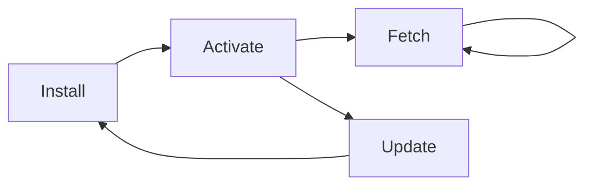
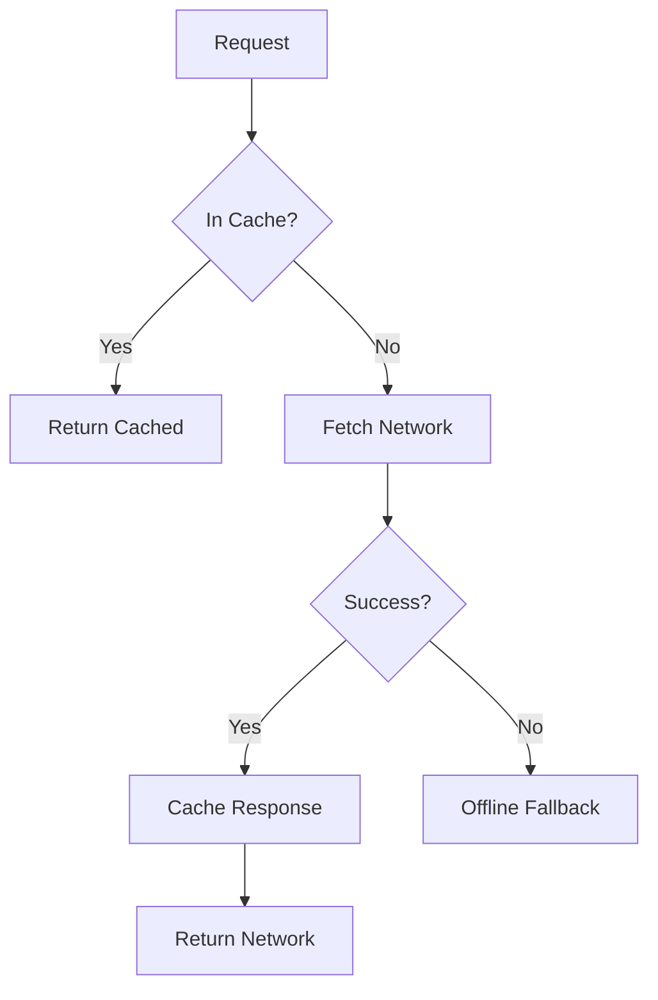

The **Service Worker** enables **Estudo Organizado** to function as a Progressive Web App (PWA), providing offline access, fast load times, and app-like behavior on mobile devices.

## PWA Features

<Note>
- **Offline Access** - Study even without internet connection
- **Install to Home Screen** - Launch like a native app on mobile
- **Fast Loading** - Cached assets load instantly
- **Background Sync** - Sync study data when connection returns
</Note>

## Service Worker Lifecycle

The service worker operates through three main lifecycle events:



### 1. Install Event

Triggered when the service worker is first registered or when a new version is detected.

```javascript
self.addEventListener('install', (evt) => {
    evt.waitUntil(
        caches.open(CACHE_NAME).then((cache) => {
            console.log('SW: Caching App Shell');
            return cache.addAll(ASSETS);
        })
    );
});
```

**What it does:**
1. Creates a new cache with the current version name
2. Pre-caches all critical assets (app shell)
3. Waits for caching to complete before installing

<Warning>
If **any** asset in `ASSETS` fails to cache, the entire installation fails and the old service worker remains active. This ensures the app never breaks from partial updates.
</Warning>

### 2. Activate Event

Triggered after installation when the service worker takes control.

```javascript
self.addEventListener('activate', (evt) => {
    evt.waitUntil(
        caches.keys().then((keys) => {
            return Promise.all(keys
                .filter(key => key !== CACHE_NAME)
                .map(key => caches.delete(key))
            );
        })
    );
});
```

**What it does:**
1. Retrieves all existing cache names
2. Deletes old caches that don't match the current version
3. Ensures only the latest assets are stored

<Accordion title="Why delete old caches during activation?">
Each service worker version creates a new cache (`estudo-organizado-v1`, `estudo-organizado-v2`, etc.). Without cleanup:

- Multiple cache versions accumulate
- Storage quota gets exhausted
- Stale assets might be served

Activation is the safe time to clean up because:
- The new service worker has already installed
- Old caches are no longer needed
- The app is transitioning to the new version
</Accordion>

### 3. Fetch Event

Triggered on every network request from the app.

```javascript
self.addEventListener('fetch', (evt) => {
    // Ignore non-GET requests (POST to Cloudflare or Google APIs)
    if (evt.request.method !== 'GET') return;

    // Ignore external API endpoints
    const url = new URL(evt.request.url);
    if (!url.pathname.startsWith('/src/') && url.origin !== location.origin) {
        return;
    }

    evt.respondWith(
        caches.match(evt.request).then(cacheRes => {
            // Return cached version or fetch from network 
            return cacheRes || fetch(evt.request).then(fetchRes => {
                // Dynamically cache new assets
                return caches.open(CACHE_NAME).then(cache => {
                    cache.put(evt.request.url, fetchRes.clone());
                    return fetchRes;
                });
            });
        }).catch(() => {
            // If offline and page not cached, show index fallback
            if (evt.request.url.indexOf('.html') > -1) {
                return caches.match('./index.html');
            }
        })
    );
});
```

**What it does:**
1. Filters requests (only intercepts GET requests to same-origin)
2. Checks cache first
3. Falls back to network if not cached
4. Dynamically caches successful network responses
5. Provides offline fallback for HTML pages

## Caching Strategy

The service worker implements a **Cache First with Network Fallback** strategy:



### Strategy Breakdown

#### 1. Cache First

```javascript
caches.match(evt.request).then(cacheRes => {
    return cacheRes || fetch(evt.request);
})
```

**Benefits:**
- Instant loading for cached assets
- Works offline
- Reduces bandwidth usage

**Tradeoffs:**
- May serve stale content until service worker updates
- Not suitable for real-time data (API calls excluded)

#### 2. Dynamic Caching

```javascript
fetch(evt.request).then(fetchRes => {
    return caches.open(CACHE_NAME).then(cache => {
        cache.put(evt.request.url, fetchRes.clone());
        return fetchRes;
    });
})
```

New assets encountered during runtime are automatically cached:
- User-uploaded images
- Lazily loaded modules
- Dynamically imported dependencies

<Note>
**Response Cloning:** `fetchRes.clone()` is critical because Response streams can only be read once. We need two copies - one for caching, one to return to the app.
</Note>

#### 3. Offline Fallback

```javascript
.catch(() => {
    if (evt.request.url.indexOf('.html') > -1) {
        return caches.match('./index.html');
    }
})
```

When offline and a page isn't cached, serve the index as fallback. This enables:
- Single-page app routing to still work
- User sees the app shell instead of browser error page
- Client-side router can handle the route

## App Shell Architecture

The `ASSETS` array defines the **app shell** - critical resources pre-cached during installation:

```javascript
const ASSETS = [
    './',
    './index.html',
    './css/styles.css',
    './js/app.js',
    './js/cloud-sync.js',
    './js/components.js',
    './js/drive-sync.js',
    './js/logic.js',
    './js/main.js',
    './js/planejamento-wizard.js',
    './js/registro-sessao.js',
    './js/store.js',
    './js/utils.js',
    './js/views.js',
    'favicon.ico'
];
```

### What's Included

- **HTML Shell** - Base page structure
- **Core Styles** - UI rendering CSS
- **JavaScript Modules** - All app logic
- **Icons** - Favicon and app icons

### What's Excluded

- **User Data** - Stored in IndexedDB, not service worker cache
- **External APIs** - Google Drive, Cloudflare sync endpoints
- **POST Requests** - Dynamic operations that shouldn't be cached

<Warning>
Do **not** cache API endpoints or user-specific data in the service worker. Use IndexedDB for persistent storage and let the app handle data sync logic.
</Warning>

## Request Filtering

The service worker selectively intercepts requests:

### 1. Method Filtering

```javascript
if (evt.request.method !== 'GET') return;
```

**Why:** POST, PUT, DELETE requests modify data and should never be cached. Only GET requests (read operations) are safe to cache.

### 2. Origin Filtering

```javascript
const url = new URL(evt.request.url);
if (!url.pathname.startsWith('/src/') && url.origin !== location.origin) {
    return;
}
```

**Why:**
- External APIs (Google Drive, Cloudflare) have their own caching headers
- Third-party CDNs shouldn't be cached (may update independently)
- Only app-owned resources should go through the cache strategy

<Accordion title="Why check pathname.startsWith('/src/')?">
This allows caching of development assets during local testing:

```
localhost:3000/src/js/app.js  ✅ Cached (pathname starts with /src/)
localhost:3000/index.html     ✅ Cached (same origin)
https://apis.google.com/...   ❌ Not cached (different origin, not /src/)
```

In production, all same-origin requests are cached regardless of path.
</Accordion>

## Cache Versioning

```javascript
const CACHE_NAME = 'estudo-organizado-v1';
```

### Version Update Flow

1. **Developer updates code** → Increments version to `v2`
2. **User visits app** → Browser detects new service worker
3. **Install event** → Creates `estudo-organizado-v2` cache
4. **Activate event** → Deletes `estudo-organizado-v1`
5. **New version active** → App now serves from v2 cache

<Note>
**Atomic Updates:** The old cache remains active until the new one fully installs. Users never experience a broken state during updates.
</Note>

## Offline Behavior

### Scenario 1: First Visit (Online)

1. Service worker installs
2. App shell cached
3. User interacts with app
4. Dynamic assets cached as encountered

### Scenario 2: Return Visit (Offline)

1. Service worker intercepts all requests
2. Returns cached app shell instantly
3. App loads from cache (less than 100ms)
4. User can study with cached data
5. Sync operations queued for when online

### Scenario 3: Partial Cache (Offline)

```javascript
.catch(() => {
    if (evt.request.url.indexOf('.html') > -1) {
        return caches.match('./index.html');
    }
})
```

User navigates to a page not in cache:
1. Fetch fails (offline)
2. Fallback to `index.html`
3. Client-side router renders the route
4. Works because app is a SPA

## Installation & Registration

The service worker is registered from the main app:

```javascript
// In main.js or app.js
if ('serviceWorker' in navigator) {
    navigator.serviceWorker.register('/sw.js')
        .then(reg => console.log('Service Worker registered', reg))
        .catch(err => console.error('Service Worker registration failed', err));
}
```

### Browser Support

<Note>
**Supported:** Chrome, Edge, Firefox, Safari 11.1+, Opera

**Not Supported:** IE11, older Safari versions

The app gracefully degrades - service worker features are optional enhancements.
</Note>

## Cache Size Management

Browsers limit cache storage (typically 50-250MB depending on device).

### Current Strategy

- **App shell:** ~500KB
- **Dynamic assets:** Unbounded (browser manages eviction)
- **User data:** Stored in IndexedDB (separate quota)

### Future Optimization

```javascript
// Potential: Cache size limiting
const MAX_CACHE_SIZE = 50; // Maximum number of cached items

async function trimCache(cacheName, maxItems) {
    const cache = await caches.open(cacheName);
    const keys = await cache.keys();
    if (keys.length > maxItems) {
        await cache.delete(keys[0]); // Delete oldest
        await trimCache(cacheName, maxItems); // Recursive trim
    }
}
```

## Debugging Service Workers

### Chrome DevTools

1. Open DevTools → **Application** tab
2. Select **Service Workers** panel
3. View status, update, unregister

### Common Issues

<Accordion title="Service worker not updating">
**Cause:** Browser caches the service worker file itself.

**Solution:**
```javascript
// Force update on page load
navigator.serviceWorker.register('/sw.js').then(reg => {
    reg.update();
});
```

Or in DevTools: Check "Update on reload"
</Accordion>

<Accordion title="Cache not clearing">
**Cause:** Old cache version wasn't deleted.

**Solution:**
```javascript
// Manually clear all caches
caches.keys().then(keys => {
    keys.forEach(key => caches.delete(key));
});
```
</Accordion>

<Accordion title="Offline fallback not working">
**Cause:** `index.html` not in cache or path mismatch.

**Solution:** Ensure `'./index.html'` matches the actual cache entry:
```javascript
caches.match('./index.html')  // Must match ASSETS entry exactly
```
</Accordion>

## Performance Metrics

### Load Time Comparison

| Scenario | First Load | Cached Load | Offline Load |
|----------|-----------|-------------|-------------|
| **Without SW** | 2.5s | 2.5s | ❌ Fails |
| **With SW** | 2.5s | 0.3s | 0.3s |

### Cache Hit Rate

Typical cache hit rates:
- **App shell:** 100% (pre-cached)
- **Dynamic assets:** 60-80% (depends on user navigation)
- **API calls:** 0% (intentionally not cached)

## Security Considerations

<Warning>
**HTTPS Required:** Service workers only work on HTTPS (or localhost for development). This prevents man-in-the-middle attacks from injecting malicious service workers.
</Warning>

### Same-Origin Policy

```javascript
if (url.origin !== location.origin) return;
```

Only same-origin requests are cached, preventing:
- Cache poisoning from external sources
- Cross-site scripting via cached responses
- Unauthorized data access

### Content Security Policy

Service worker respects CSP headers - cached responses maintain their original security policies.

## Future Enhancements

<Note>
**Potential Features:**
- Background sync for study session data
- Push notifications for study reminders
- Periodic background sync for updated exam content
- Advanced cache strategies (network-first for API data)
</Note>

## Related Documentation

- [State Management](/architecture/state-management) - How user data is stored separately in IndexedDB
- [Cloudflare Sync](/sync/cloudflare-setup) - How online sync works alongside offline caching
- [Google Drive Sync](/sync/google-drive) - Alternative cloud backup integration