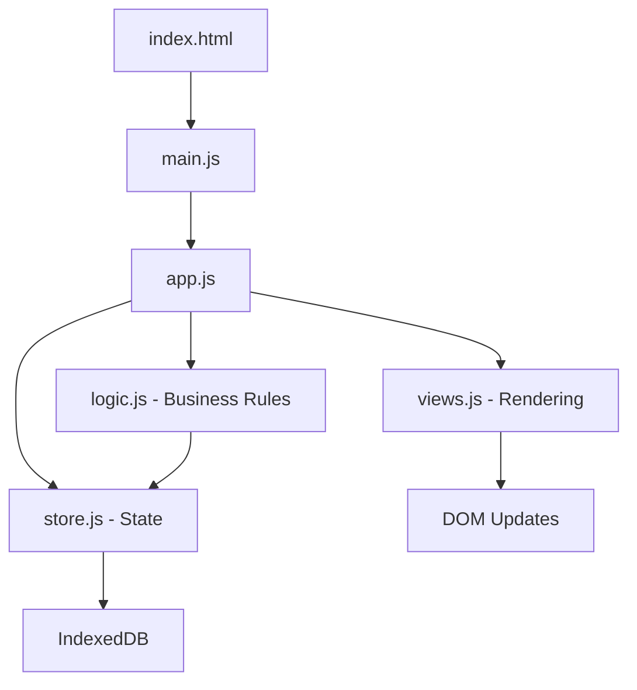

## Overview

Estudo Organizado follows a **vanilla JavaScript architecture** with no frameworks or build tools. The project is organized for simplicity and performance.

```
estudo-organizado/
├── src/                    # Main application directory
│   ├── index.html         # Application entry point
│   ├── manifest.json      # PWA manifest
│   ├── sw.js              # Service Worker for offline support
│   ├── js/                # JavaScript modules
│   └── css/               # Stylesheets
├── docs/                  # Documentation files
├── scripts/               # Utility scripts
├── screenshots/           # Application screenshots
├── README.md              # Project overview
├── LICENSE                # MIT License
└── Abrir_Estudo_Organizado.bat  # Windows launcher
```

## Core Directories

### `src/` - Application Root

The `src/` directory contains all application files that are served to users.

<Note>
All development work happens in the `src/` directory. This is where you'll run your local server from.
</Note>

#### Key Files

| File | Purpose |
|------|--------|
| `index.html` | Main HTML structure with sidebar, modals, and content container |
| `manifest.json` | PWA configuration (name, icons, theme colors) |
| `sw.js` | Service Worker with Cache-First strategy for offline support |

### `src/js/` - JavaScript Modules

The JavaScript directory contains modular components following separation of concerns:

```
js/
├── main.js                  # Application entry point & initialization
├── app.js                   # Core application logic
├── store.js                 # State management & IndexedDB operations
├── logic.js                 # Business logic & performance calculations
├── views.js                 # View rendering & DOM manipulation
├── components.js            # Reusable UI components
├── relevance.js             # NLP & Fuzzy Match engine for analysis
├── cloud-sync.js            # Cloudflare Worker synchronization
├── drive-sync.js            # Google Drive API integration
├── notifications.js         # Notification system
├── planejamento-wizard.js   # Study planning wizard
├── registro-sessao.js       # Study session registration
└── lesson-mapper.js         # Lesson mapping utilities
```

#### Key Modules

<Accordion title="store.js - State Management">
  Manages application state and IndexedDB operations:
  
  - Local data persistence
  - CRUD operations for events, editais, subjects
  - State synchronization
  - Data export/import (JSON backup)
</Accordion>

<Accordion title="logic.js - Business Logic">
  Core business rules and calculations:
  
  - PDCA Cycle implementation (Plan-Do-Check-Act)
  - Performance metrics computation
  - Study session calculations
  - Spaced repetition intervals (1, 7, 30, 90 days)
</Accordion>

<Accordion title="relevance.js - NLP Engine">
  Natural Language Processing and fuzzy matching:
  
  - Intelligent analysis of exam board patterns
  - Subject matching algorithms
  - Predictive analytics for "Inteligência de Banca" feature
</Accordion>

<Accordion title="views.js - View Orchestration">
  Handles dynamic rendering and view updates:
  
  - Navigation between different app sections
  - Modal management
  - Dynamic content injection
  - Event delegation
</Accordion>

<Accordion title="components.js - UI Components">
  Reusable UI components and widgets:
  
  - Custom form controls
  - Calendar widgets
  - Chart components (uses Chart.js)
  - Timer/Pomodoro components
</Accordion>

### `src/css/` - Stylesheets

Contains all CSS files for styling the application:

```
css/
└── styles.css    # Main stylesheet with custom properties (CSS variables)
```

#### Styling Approach

- **CSS Custom Properties** for theming (Furtivo, Rubi, Matrix themes)
- **Responsive design** with mobile-first approach
- **Dark mode** support via theme toggle
- Uses **Font Awesome 6.4.0** for icons
- Uses **Plus Jakarta Sans** and **DM Mono** font families

### `docs/` - Documentation

Contains project documentation files:

- Setup guides (e.g., `CLOUDFLARE-SETUP.md`)
- API documentation
- User guides

### `scripts/` - Utility Scripts

Helper scripts for development and maintenance:

- Deployment scripts
- Data migration tools
- Build utilities (if needed)

## Architecture Patterns

### No Framework Philosophy

<Note>
Estudo Organizado deliberately uses **vanilla JavaScript** instead of frameworks like React or Vue. This decision prioritizes:

- **Performance** - No framework overhead
- **Simplicity** - Direct DOM manipulation
- **Learning** - Pure JavaScript skills
- **Bundle Size** - Minimal dependencies
</Note>

### Module Organization

The codebase follows a **modular architecture**:

1. **Separation of Concerns**: Each module has a single responsibility
2. **ES6 Modules**: Uses `import`/`export` for code organization
3. **Event Delegation**: Centralized event handling via data attributes
4. **State Management**: Centralized in `store.js`

### Data Flow



## PWA Architecture

### Service Worker Strategy

The `sw.js` implements a **Cache-First** strategy:

1. Check cache for requested resource
2. If found, return cached version (instant load)
3. If not found, fetch from network and cache it
4. Supports offline functionality

### Manifest Configuration

The `manifest.json` defines:

- App name and short name
- Icons (various sizes)
- Theme colors
- Display mode (standalone)
- Start URL

## Dependencies

### External Libraries

The application uses minimal external dependencies:

| Library | Version | Purpose |
|---------|---------|--------|
| **Chart.js** | 4.4.0 | Dashboard charts and analytics |
| **Font Awesome** | 6.4.0 | Icon library |
| **Google Fonts** | - | Plus Jakarta Sans, DM Mono |

### No Build Process

<Note>
Unlike modern frameworks, Estudo Organizado requires **no build step**. Changes to HTML, CSS, or JS files are immediately reflected after a browser refresh.
</Note>

## File Naming Conventions

- **HTML**: `index.html` (single entry point)
- **JavaScript**: Kebab-case (e.g., `cloud-sync.js`, `registro-sessao.js`)
- **CSS**: `styles.css` (single stylesheet)
- **Configuration**: Lowercase (e.g., `manifest.json`, `wrangler.jsonc`)

## Next Steps

Now that you understand the structure:

- [Development Workflow](/developers/development-workflow) - Learn how to make changes
- [Environment Setup](/developers/setup) - Set up your development environment
