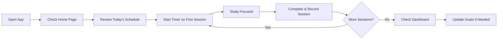

## Welcome to Estudo Organizado!

This guide will walk you through the essential steps to start using Estudo Organizado for your exam preparation. In just a few minutes, you'll have your first exam syllabus set up and your first study session tracked.

<Note>
  If you haven't installed Estudo Organizado yet, check out the [Installation Guide](/installation) first.
</Note>

## Overview

Estudo Organizado follows the **PDCA Cycle** methodology:

1. **Plan**: Create exam syllabi (editais) and schedule study sessions in the Calendar
2. **Do**: Execute study sessions using the Study Organizer with integrated timer
3. **Check**: Monitor your progress in the Dashboard with detailed metrics
4. **Act**: Review topics using the Spaced Repetition system

Let's get started!

---

## Step 1: Create Your First Exam Syllabus (Edital)

Before you can track study sessions, you need to create at least one exam syllabus with subjects and topics.

<Steps>
  <Step title="Navigate to Editais">
    Click **Editais** (📋) in the left sidebar
    
    
  </Step>
  
  <Step title="Create New Edital">
    Click the **"+ Novo Edital"** button
    
    Fill in the form:
    - **Nome**: Name of the exam (e.g., "INSS 2026")
    - **Banca**: Exam board (e.g., "Cebraspe")
    - **Cor**: Choose a color for visual identification
    
    Click **Salvar** to create the edital
  </Step>
  
  <Step title="Add Disciplines">
    Click **"+ Adicionar Disciplina"** within your edital
    
    Fill in:
    - **Nome**: Subject name (e.g., "Direito Constitucional")
    - **Ícone**: Choose an emoji icon (e.g., 📖)
    
    Click **Salvar**
  </Step>
  
  <Step title="Add Topics (Assuntos)">
    Click **"Gerenciar Assuntos"** for your discipline
    
    Add topics one by one or in bulk:
    - **Nome**: Topic name (e.g., "Direitos Fundamentais")
    - **Descrição**: Optional details
    
    Click **Salvar Assuntos**
  </Step>
</Steps>

<Note>
  **Tip**: You can add multiple topics at once by clicking "+ Adicionar Assunto" repeatedly before saving. This speeds up the initial setup.
</Note>

---

## Step 2: Schedule Your First Study Session

Now that you have an edital structure, let's schedule a study session.

<Steps>
  <Step title="Go to Study Organizer">
    Click **Study Organizer** (⏱️) in the left sidebar
  </Step>
  
  <Step title="Start New Session">
    Click **"+ Iniciar Estudo"** or **"Novo Evento"**
    
    The event modal will open with a form
  </Step>
  
  <Step title="Fill in Session Details">
    Complete the study session form:
    
    - **Data**: Select the date (default: today)
    - **Tipo**: Choose session type:
      - Videoaula (Video lesson)
      - Questões (Practice questions)
      - Revisão (Review)
      - Leitura (Reading)
      - Simulado (Mock exam)
      - And more...
    - **Edital**: Select the exam syllabus you created
    - **Disciplina**: Choose the subject
    - **Assunto**: Select the specific topic
    - **Tempo Planejado**: Set planned duration (optional)
  </Step>
  
  <Step title="Save and Start">
    Click **Salvar** or **"Iniciar Agora"** to create the session
    
    If you chose "Iniciar Agora", the timer will start automatically
  </Step>
</Steps>

---

## Step 3: Use the Study Timer

Estudo Organizado includes an integrated Pomodoro-style timer for focused study sessions.

### Starting the Timer

<Steps>
  <Step title="Find Your Session">
    In the Study Organizer view, locate your scheduled session
    
    Sessions are organized by status:
    - **Agendados** (Scheduled)
    - **Estudados** (Completed)
    - **Atrasados** (Overdue)
  </Step>
  
  <Step title="Click Play Button">
    Click the ▶️ **Play** button on your session card
    
    The timer will start counting up from 00:00:00
  </Step>
  
  <Step title="Study Focused">
    The timer tracks your study time automatically
    
    The interface shows:
    - Current elapsed time
    - Topic being studied
    - Pause and stop controls
  </Step>
  
  <Step title="Pause if Needed">
    Click the ⏸️ **Pause** button to take a break
    
    Your time is preserved - click Play to resume
  </Step>
</Steps>

### Timer Modes

Estudo Organizado supports two timer modes:

<Tabs>
  <Tab title="Continuous Mode (Default)">
    **Continuous Timer**
    
    - Counts up from 00:00:00
    - No time limit
    - Best for flexible study sessions
    - Switch via button in top bar: **"Contínuo"**
  </Tab>
  
  <Tab title="Pomodoro Mode">
    **Pomodoro Timer**
    
    - Counts down from set duration (e.g., 25:00)
    - Alerts when time expires
    - Best for time-boxed focus sessions
    - Switch via button in top bar: **"Pomodoro"**
  </Tab>
</Tabs>

<Note>
  You can toggle between timer modes using the button in the top navigation bar without losing your current timer state.
</Note>

---

## Step 4: Complete and Save Your Session

After finishing your study session, record what you accomplished.

<Steps>
  <Step title="Stop the Timer">
    Click the ⏹️ **Stop** button when you finish studying
    
    A registration modal will appear
  </Step>
  
  <Step title="Record Session Details">
    In the **"Registro da Sessão de Estudo"** modal, fill in:
    
    - **Tempo Estudado**: Total study time (auto-filled from timer)
    - **Questões Feitas**: Number of practice questions completed
    - **Acertos**: Number of correct answers
    - **Páginas Lidas**: Pages read (for reading sessions)
    - **Observações**: Notes or reflections
    - **Efetividade**: Rate session effectiveness (1-5 stars)
  </Step>
  
  <Step title="Mark Topics as Completed">
    If you finished studying a topic completely, you can:
    
    - Check **"Marcar assunto como concluído"**
    - This triggers the spaced repetition system
    - The topic will appear in Revisões at scheduled intervals
  </Step>
  
  <Step title="Save the Session">
    Click **"💾 Salvar Registro"**
    
    Options:
    - **Salvar**: Save and close
    - **Salvar e iniciar nova ↻**: Save and immediately start a new session
  </Step>
</Steps>

<Warning>
  Don't forget to save your session! The timer state is preserved across browser sessions, but recording your accomplishments is what builds your study history and metrics.
</Warning>

---

## Step 5: View Your Progress

After completing sessions, check your progress in the Dashboard.

<Steps>
  <Step title="Navigate to Dashboard">
    Click **Dashboard** (📊) in the left sidebar
  </Step>
  
  <Step title="Review Your Metrics">
    The Dashboard shows:
    
    - **Total Study Time**: Hours studied per subject
    - **Study Sessions**: Number of sessions completed
    - **Questions Completed**: Practice questions answered
    - **Accuracy Rate**: Percentage of correct answers
    - **Study Streak**: Consecutive days studied
    - **Weekly Goals**: Progress toward hour/question targets
  </Step>
  
  <Step title="Filter by Time Period">
    Use filters to view:
    - Last 7 days
    - Last 30 days
    - Last 90 days
    - Custom date range
  </Step>
  
  <Step title="Analyze by Subject">
    Click on specific subjects to see:
    - Time distribution across topics
    - Topic completion percentage
    - Performance trends
  </Step>
</Steps>

---

## Essential Features to Explore

Now that you've completed your first study cycle, explore these powerful features:

<CardGroup cols={2}>
  <Card title="Spaced Repetition" icon="rotate" href="/features/revisions">
    Automatically schedule reviews at optimal intervals: 1, 7, 30, and 90 days after completion
  </Card>
  
  <Card title="Calendar View" icon="calendar" href="/features/calendar">
    Visualize your study schedule in monthly or weekly views with color-coded subjects
  </Card>
  
  <Card title="Study Cycles" icon="recycle" href="/features/ciclo">
    Create continuous study cycles that automatically rotate through all subjects
  </Card>
  
  <Card title="Habits Tracker" icon="bolt" href="/features/habitos">
    Track daily study habits and build consistency across different study types
  </Card>
  
  <Card title="Exam Board Intelligence" icon="brain" href="/features/banca-analyzer">
    Analyze topic frequency from past exams to prioritize high-yield content
  </Card>
  
  <Card title="Sync & Backup" icon="cloud" href="/configuration/sync">
    Synchronize across devices with Cloudflare or Google Drive
  </Card>
</CardGroup>

---

## Quick Tips for Success

<AccordionGroup>
  <Accordion title="Use the Global Search">
    Press the search bar in the top navigation to quickly find:
    - Specific study events
    - Topics and subjects
    - Habits and metrics
    
    This saves time navigating through menus.
  </Accordion>
  
  <Accordion title="Set Weekly Goals">
    Go to **Home Page** → Click **"Metas da Semana"**
    
    Set realistic targets:
    - Hours per week (e.g., 20 hours)
    - Questions per week (e.g., 150 questions)
    
    The Dashboard will track your progress toward these goals.
  </Accordion>
  
  <Accordion title="Customize Your Theme">
    Navigate to **Configurações** (⚙️)
    
    Choose from themes:
    - Light Mode
    - Dark Mode (default)
    - Furtivo (Stealth)
    - Rubi (Ruby)
    - Matrix
    
    Toggle with the 🌙/☀️ button in the top bar.
  </Accordion>
  
  <Accordion title="Enable Offline Access">
    The app works offline automatically once installed as a PWA.
    
    To ensure offline functionality:
    1. Visit the app while online at least once
    2. Wait for Service Worker to cache resources
    3. All your data is stored locally in IndexedDB
    
    You can study without internet!
  </Accordion>
  
  <Accordion title="Export Your Data Regularly">
    Go to **Configurações** → **Backup**
    
    Click **"Exportar Dados"** to download a JSON backup
    
    This protects your study history and allows you to:
    - Transfer to a new device
    - Recover from accidental data loss
    - Keep archive copies
  </Accordion>
</AccordionGroup>

---

## Common Workflows

### Daily Study Routine

### Weekly Planning Routine

1. **Monday Morning**: Review Dashboard metrics from last week
2. **Plan Week**: Add study sessions to Calendar for upcoming week
3. **Adjust Goals**: Update weekly targets based on available time
4. **Prioritize**: Use Exam Board Intelligence to focus on high-frequency topics
5. **Review**: Schedule spaced repetition sessions from Revisões tab

---

## Getting Help

If you need assistance:

<CardGroup cols={2}>
  <Card title="Feature Guides" icon="book" href="/features/study-organizer">
    Detailed documentation for each module
  </Card>
  
  <Card title="Configuration" icon="gear" href="/configuration">
    Settings, themes, sync, and customization options
  </Card>
  
  <Card title="Troubleshooting" icon="wrench" href="/troubleshooting">
    Common issues and solutions
  </Card>
  
  <Card title="GitHub" icon="github" href="https://github.com">
    Report issues or contribute to the project
  </Card>
</CardGroup>

---

## You're All Set!

Congratulations! You've completed the quick start guide and are ready to make the most of Estudo Organizado. Remember:

- **Consistency** beats intensity - study regularly
- **Track everything** - data drives improvement
- **Review often** - spaced repetition is scientifically proven
- **Stay organized** - let the PDCA cycle guide your preparation

Boa sorte nos estudos! 📚