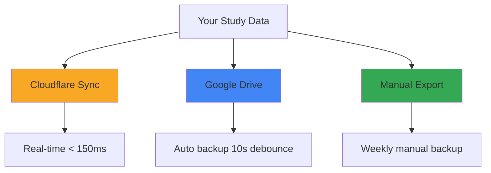

# Manual Backup & Restore

While Cloudflare and Google Drive provide automatic synchronization, manual backup and restore gives you complete control over your data with local JSON files.

<Note>
Manual backups are perfect for:
- Creating local copies before major changes
- Migrating to a new device
- Recovering from accidental data loss
- Archiving old study sessions
</Note>

## Quick Export

Export your entire study database to a JSON file:

<Steps>
  <Step title="Open Settings">
    Click the ⚙️ Settings icon in the navigation bar
  </Step>

  <Step title="Find Backup Section">
    Scroll to the **Backup & Restore** section
  </Step>

  <Step title="Export Data">
    Click the **Export Data** button
  </Step>

  <Step title="Save File">
    Your browser will download a file named:
    
    ```
    estudo-organizado-backup-YYYY-MM-DD.json
    ```
    
    The filename includes the current date for easy organization.
  </Step>
</Steps>

<Tip>
Create weekly backups before exam periods or when making major changes to your study plan.
</Tip>

## Quick Import

Restore data from a previously exported JSON file:

<Steps>
  <Step title="Open Settings">
    Click the ⚙️ Settings icon
  </Step>

  <Step title="Find Backup Section">
    Scroll to the **Backup & Restore** section
  </Step>

  <Step title="Choose File">
    Click **Import Data** and select your backup JSON file
  </Step>

  <Step title="Confirm Restore">
    The app will show a confirmation dialog:
    
    <Warning>
    Importing will **overwrite all current data**. Make sure you have a backup of your current state if needed!
    </Warning>
    
    Click **Confirm** to proceed with the restore.
  </Step>

  <Step title="Verify Data">
    After import:
    - The app will reload the current view
    - Check that your subjects, tasks, and flashcards are present
    - Review recent study sessions
  </Step>
</Steps>

## Data Structure

The exported JSON contains your complete application state:

```json
{
  "subjects": [
    {
      "id": "subj_1234567890",
      "name": "Mathematics",
      "color": "#4A90E2",
      "createdAt": 1234567890000
    }
  ],
  "tasks": [
    {
      "id": "task_1234567890",
      "subjectId": "subj_1234567890",
      "title": "Study Calculus Chapter 3",
      "completed": false,
      "dueDate": "2026-03-15"
    }
  ],
  "flashcards": [
    {
      "id": "flash_1234567890",
      "subjectId": "subj_1234567890",
      "question": "What is the derivative of x²?",
      "answer": "2x"
    }
  ],
  "sessions": [
    {
      "id": "sess_1234567890",
      "subjectId": "subj_1234567890",
      "startTime": 1234567890000,
      "endTime": 1234567890000,
      "duration": 3600
    }
  ],
  "config": {
    "theme": "dark",
    "cfUrl": "https://estudo-sync-api.xxx.workers.dev",
    "cfToken": "your-secret-token",
    "_lastUpdated": 1234567890000
  }
}
```

<Accordion title="Full Schema Details">
  The state object includes:
  
  - **subjects**: Array of subject objects with id, name, color, goals
  - **tasks**: Todo items linked to subjects
  - **flashcards**: Study cards with questions/answers
  - **sessions**: Study session records with time tracking
  - **config**: App settings including sync configuration
  - **lastSync**: Timestamp of last Google Drive sync
  - **driveFileId**: Google Drive file reference
</Accordion>

## Export Implementation

The export function creates a downloadable JSON file:

```javascript
function exportData() {
    const dataStr = JSON.stringify(state, null, 2);
    const dataBlob = new Blob([dataStr], { type: 'application/json' });
    const url = URL.createObjectURL(dataBlob);
    
    const link = document.createElement('a');
    link.href = url;
    link.download = `estudo-organizado-backup-${new Date().toISOString().split('T')[0]}.json`;
    link.click();
    
    URL.revokeObjectURL(url);
}
```

<Note>
The export includes a 2-space indentation (`null, 2`) making the JSON human-readable.
</Note>

## Import Implementation

The import function validates and loads the backup:

```javascript
function importData(file) {
    const reader = new FileReader();
    
    reader.onload = (e) => {
        try {
            const importedState = JSON.parse(e.target.result);
            
            // Validate basic structure
            if (!importedState.subjects || !Array.isArray(importedState.subjects)) {
                throw new Error('Invalid backup file: missing subjects array');
            }
            
            // Apply imported state
            setState(importedState);
            
            // Run migrations for compatibility
            runMigrations();
            
            // Save to IndexedDB
            saveStateToDB().then(() => {
                // Refresh UI
                renderCurrentView();
                showToast('Data imported successfully!', 'success');
            });
        } catch (err) {
            showToast('Failed to import: ' + err.message, 'error');
        }
    };
    
    reader.readAsText(file);
}
```

## Use Cases

<CardGroup cols={2}>
  <Card title="Device Migration" icon="laptop-mobile">
    Moving to a new phone or computer:
    
    1. Export from old device
    2. Transfer JSON file
    3. Import on new device
    4. Set up cloud sync
  </Card>

  <Card title="Version Control" icon="code-branch">
    Before major changes:
    
    1. Export current state
    2. Make experimental changes
    3. Import backup if needed
    4. Keep multiple versions
  </Card>

  <Card title="Data Recovery" icon="life-ring">
    Emergency recovery:
    
    1. Use latest backup file
    2. Import to restore
    3. Lose only recent changes
    4. Resume studying quickly
  </Card>

  <Card title="Archiving" icon="archive">
    End of semester:
    
    1. Export completed semester
    2. Archive for future reference
    3. Start fresh for next term
    4. Keep historical records
  </Card>
</CardGroup>

## Best Practices

<Steps>
  <Step title="Regular Backups">
    Create exports on a schedule:
    
    - **Daily**: During exam periods
    - **Weekly**: During normal study
    - **Monthly**: For long-term archives
    - **Before major changes**: Always safe
  </Step>

  <Step title="Organized Storage">
    Keep backups organized:
    
    ```
    backups/
    ├── 2026-03/
    │   ├── estudo-organizado-backup-2026-03-01.json
    │   ├── estudo-organizado-backup-2026-03-08.json
    │   └── estudo-organizado-backup-2026-03-15.json
    ├── 2026-02/
    └── archives/
        └── semester-1-2026.json
    ```
  </Step>

  <Step title="Multiple Locations">
    Store backups in multiple places:
    
    - Local computer/device
    - External drive or USB
    - Cloud storage (Dropbox, Drive, etc.)
    - Email to yourself (for critical backups)
  </Step>

  <Step title="Test Restores">
    Periodically verify backups work:
    
    1. Open app in incognito/private window
    2. Import a backup
    3. Verify data loads correctly
    4. Close private window (don't save)
  </Step>
</Steps>

## Automation Ideas

While the built-in export is manual, you can automate backups:

### Browser Bookmarklet

Create a bookmark with this JavaScript:

```javascript
javascript:(function(){
  const data = JSON.stringify(state, null, 2);
  const blob = new Blob([data], {type: 'application/json'});
  const url = URL.createObjectURL(blob);
  const a = document.createElement('a');
  a.href = url;
  a.download = `backup-${Date.now()}.json`;
  a.click();
  URL.revokeObjectURL(url);
})();
```

Click the bookmark while on the app to instantly export.

### Scheduled Reminder

Set a weekly calendar reminder:
- "Export Estudo Organizado backup"
- Every Sunday at 8 PM
- Takes 30 seconds

## Combining Sync Methods

For maximum safety, use all three methods:



<Tip>
**Recommended setup:**
- Cloudflare: Real-time sync across devices
- Google Drive: Automatic backup every 10 seconds
- Manual Export: Weekly backups to external storage
</Tip>

## Troubleshooting

<AccordionGroup>
  <Accordion title="Export button doesn't work">
    Check browser console for errors:
    
    1. Press F12 to open DevTools
    2. Click Console tab
    3. Try export again
    4. Look for error messages
    
    Common issues:
    - Popup blocker preventing download
    - Browser storage quota exceeded
    - JavaScript error in app
  </Accordion>

  <Accordion title="Import shows 'Invalid backup file'">
    The JSON structure may be corrupted:
    
    1. Open the JSON file in a text editor
    2. Verify it's valid JSON (use JSONLint.com)
    3. Check for required fields: `subjects`, `tasks`, `config`
    4. Try a different backup file
  </Accordion>

  <Accordion title="Imported data looks wrong">
    After import, data may need processing:
    
    1. Refresh the page (F5)
    2. Clear browser cache
    3. Check that migrations ran (console logs)
    4. Try importing again
  </Accordion>

  <Accordion title="Lost all data, no backup">
    If you have sync enabled:
    
    1. **Cloudflare**: Data is in KV, just re-enter credentials
    2. **Google Drive**: File is in your Drive, reconnect
    3. Check browser's IndexedDB directly (DevTools → Application)
    
    If no sync and no backup:
    - Data may be unrecoverable
    - This is why regular backups are critical
  </Accordion>
</AccordionGroup>

## File Size Considerations

Backup file size depends on your data:

- **Small** (< 100 KB): Few subjects, minimal sessions
- **Medium** (100-500 KB): Active semester, many flashcards
- **Large** (> 500 KB): Years of data, thousands of sessions

<Note>
JSON is text-based and compresses well. You can zip backup files to save space:

```bash
zip backup-archive.zip estudo-organizado-backup-*.json
```
</Note>

## Privacy & Security

<Warning>
Backup files contain all your study data in plain text:
</Warning>

- **Sync tokens**: Your Cloudflare AUTH_TOKEN is included
- **Google credentials**: Drive Client ID is stored
- **Personal data**: All subjects, notes, tasks

**Best practices:**
1. Don't share backup files publicly
2. Store in secure locations only
3. Consider encrypting sensitive backups
4. Delete old backups you no longer need

### Encrypt Backups (Advanced)

For sensitive data, encrypt your backups:

```bash
# Encrypt (requires password)
openssl enc -aes-256-cbc -salt -in backup.json -out backup.json.enc

# Decrypt later
openssl enc -aes-256-cbc -d -in backup.json.enc -out backup.json
```

## Next Steps

<CardGroup cols={2}>
  <Card title="Cloudflare Setup" icon="cloud" href="/sync/cloudflare-setup">
    Set up automatic edge sync for real-time updates
  </Card>
  <Card title="Google Drive" icon="google" href="/sync/google-drive">
    Enable automatic cloud backups every 10 seconds
  </Card>
</CardGroup>